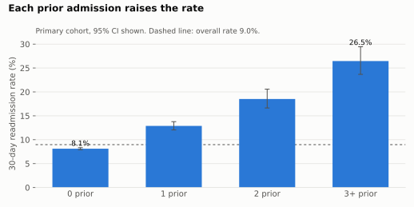
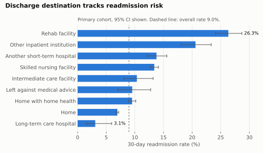
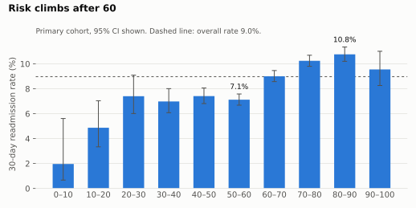
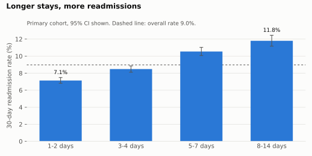

# Hospital Readmission Analysis — 101,766 Diabetic Inpatient Encounters

**SQL · Python · Power BI** — which patients come back to hospital within 30 days, and where
should discharge planning focus?

**Lokeshkumar Rajagopal** · MSc Biomedical Engineering · [LinkedIn](https://linkedin.com/in/lokesh29)

---

## The short version

Of **69,970 diabetic patients** on their first recorded stay, **6,277 (9.0%, 95% CI 8.8–9.2%)**
were readmitted within 30 days.

| What stood out | Rate | vs. |
|---|---|---|
| **3+ inpatient admissions in the prior year** | **26.5%** | 8.1% with none — 3.3× higher |
| **Discharged to a rehab facility** | **26.3%** | 6.9% discharged home — 3.8× higher |
| **Stay of 8–14 days** | **11.8%** | 7.1% for 1–2 days |
| **Aged 80–90** | **10.8%** | 7.1% aged 50–60 |

**The finding that matters most for a hospital is the one that looks least dramatic:**
patients with no prior admissions have the *lowest* rate, but they are 88% of the cohort, so
they account for **80% of all readmissions**. A programme that only targets the frequent
readmitters would reach 3.4% of patients and 8.2% of readmissions. High-risk and high-volume
are different groups, and they need different interventions.



---

## Data

[Diabetes 130-US Hospitals for Years 1999–2008](https://archive.ics.uci.edu/dataset/296/diabetes+130-us+hospitals+for+years+1999-2008)
— UCI Machine Learning Repository, CC BY 4.0. 101,766 inpatient encounters of diabetic
patients from 130 US hospitals, 50 fields per encounter: demographics, admission and discharge
details, up to three ICD-9 diagnoses, lab results, 23 diabetes medications, and the
readmission outcome.

Source study: Strack B. et al. (2014). *Impact of HbA1c Measurement on Hospital Readmission
Rates: Analysis of 70,000 Clinical Database Patient Records.* BioMed Research International,
781670.

The raw file is not committed. Download the zip from the link above into `data/raw/`.

---

## Method

The definitions and questions were written down in [`ANALYSIS_PLAN.md`](ANALYSIS_PLAN.md)
**before** any query was run, so they could not be adjusted to make the results look better.

**Unit of analysis.** The same patient can appear many times, and frequent readmitters are
exactly the patients most likely to be readmitted again. Counting every encounter would let
them dominate. So the primary cohort is **one encounter per patient** — the first — which is
also what the source study did. The difference is not small:

| Counting method | Encounters | Readmitted < 30 days | Rate |
|---|---:|---:|---:|
| Every encounter, raw | 101,766 | 11,357 | 11.2% |
| Every encounter, exclusions removed | 99,340 | 11,314 | 11.4% |
| **First encounter per patient (primary cohort)** | **69,970** | **6,277** | **9.0%** |

**Exclusions.** Encounters that ended in death or hospice (2,423) were removed, because those
patients cannot be readmitted and would pull the rate down. Three encounters with invalid
gender were removed. Every step is logged in the database's `dq_log` table.

**Statistics.** Each rate carries a 95% Wilson confidence interval. Differences across groups
are tested with a chi-square test of independence. Nine tests were run, so the Bonferroni
threshold is **p < 0.0056**; anything between that and 0.05 is reported as weak evidence, not
a finding.

### Pipeline

```
data/raw/diabetic_data.csv ─┐
data/raw/IDS_mapping.csv ───┴─► src/01_build_database.py ─► data/readmission.db (SQLite)
                                                                     │
                     sql/*.sql ◄──── src/02_run_analysis.py ◄────────┤  results/*.csv, summary.md
                                     src/03_make_charts.py  ◄────────┤  charts/*.svg
                                     src/04_export_powerbi.py ◄──────┘  powerbi/data/*.csv
```

**Database schema** (normalised from the single wide CSV):

| Table | Rows | Grain |
|---|---:|---|
| `encounters` | 101,766 | one per hospital stay, with `is_index` and `excluded_reason` flags |
| `diagnoses` | 303,496 | one per encounter × diagnosis position (wide `diag_1..3` unpivoted), 915 distinct ICD-9 codes |
| `medications` | 120,054 | one per encounter × drug actually prescribed (23 wide columns unpivoted) |
| `lk_admission_type`, `lk_discharge_disposition`, `lk_admission_source`, `lk_age_band` | — | lookups |
| `dq_log`, `dq_missing` | — | cleaning audit trail and missingness profile |
| `cohort` (view) | 69,970 | the primary analysis population |

The SQL in [`sql/`](sql/) uses CTEs, joins to lookup tables, `CASE` banding, `UNION ALL`,
and window functions — `SUM() OVER ()` for shares of total and `LAG() OVER (PARTITION BY
patient ORDER BY encounter)` to link each stay to the patient's previous one.

---

## Results

All rates are for the primary cohort (n = 69,970) unless stated. Full tables with confidence
intervals: [`results/summary.md`](results/summary.md).

### 1. Prior admissions — the steepest gradient

| Inpatient admissions in prior year | Patients | Rate | 95% CI |
|---|---:|---:|---|
| 0 | 61,779 | 8.1% | 7.9–8.3 |
| 1 | 5,794 | 12.9% | 12.1–13.8 |
| 2 | 1,501 | 18.5% | 16.6–20.6 |
| 3+ | 896 | 26.5% | 23.7–29.4 |

χ² = 667.1, df = 3, p < 0.001. Each of the first two prior admissions adds about 5 percentage points.

### 2. Discharge destination



Patients discharged home have one of the lowest rates (6.9%, n = 44,315); those transferred to a rehab
facility the highest (26.3%, n = 1,409), followed by other inpatient institutions (20.6%) and
another short-term hospital (13.8%). χ² = 1,241.5, df = 11, p < 0.001.

This is almost certainly **confounded by severity**: sicker patients are the ones sent to
rehab. It says where the risk sits, not that the destination causes it. Even so, the 11,106
patients sent to skilled nursing, rehab or another inpatient institution account for 27.6% of
readmissions — a defined handover point where a hospital can act.

### 3. Age and length of stay



The rate sits near 7% from age 20 to 60, then climbs to 10.2% at 70–80 and 10.8% at 80–90
(χ² = 188.2, p < 0.001). Length of stay shows a clean dose-response: 7.1% for 1–2 days rising
to 11.8% for 8–14 days (χ² = 242.0, p < 0.001).



### 4. Primary diagnosis

Injury had the highest rate (10.8%) and respiratory the lowest (7.3%); circulatory, the largest
group at 21,383 patients, sat at 9.7%. χ² = 75.2, df = 9, p < 0.001. The spread is narrower
than for prior admissions or discharge destination.

### 5. HbA1c testing — the source study's question

Only **18.4%** of patients had HbA1c measured during their stay, despite all being diabetic.
Those who were tested had a slightly lower readmission rate:

| | Patients | Rate | 95% CI |
|---|---:|---:|---|
| HbA1c tested | 12,845 | 8.4% | 7.9–8.9 |
| Not tested | 57,125 | 9.1% | 8.9–9.3 |

χ² = 6.4, p = 0.012 — **which does not clear the Bonferroni threshold.** The direction matches
the source study, but the gap is 0.7 percentage points and this project does not adjust for
anything else, whereas the study used a multivariable model and found the effect depended on
primary diagnosis. Crossing the HbA1c result with medication change (p = 0.031) is weaker still.
Reported for completeness, not as a finding.

### 6. Insulin

Patients whose insulin dose was reduced during the stay had a 10.5% rate against 8.3% for those
not on insulin (χ² = 50.6, p < 0.001). Dose changes are a marker of unstable glucose control,
so this is more likely a severity signal than an effect of the change itself.

### 7. Utilisation is concentrated

| Encounters per patient | Share of patients | Share of encounters |
|---|---:|---:|
| 1 | 76.7% | 54.0% |
| 2 | 14.6% | 20.6% |
| 3–4 | 6.6% | 15.2% |
| 5+ | 2.2% | 10.2% |

The 23.4% of patients with more than one stay account for 46% of all encounters. Among those
repeat patients, a stay that follows a < 30-day readmission is itself readmitted 21.6% of the
time, against 15.5% when the previous stay was not (χ² = 152.2, p < 0.001) — a revolving door.

### 8. Data quality

| Field | Missing |
|---|---:|
| `weight` | 96.9% |
| `medical_specialty` | 49.1% |
| `payer_code` | 39.6% |
| `race` | 2.2% |
| `diag_3` / `diag_2` / `diag_1` | 1.4% / 0.35% / 0.02% |

`weight` is unusable and was not analysed. Admitting specialty and payer are missing for so many
encounters that any analysis by either would describe the hospitals that recorded them, not the
patients. A further 778 index encounters have discharge destination "Not Mapped" and 2,474 are
recorded as NULL.

---

## Recommendations

Written as a hospital quality analyst would present them to a discharge-planning lead:

1. **Two risk strategies, not one.** Flag patients with 2+ admissions in the prior year for
   intensive follow-up — small group (3.4%), very high rate (18.5–26.5%). But 80% of
   readmissions come from patients with no prior admissions, so a lighter standard intervention
   (a follow-up call within 7 days) applied to everyone reaches far more of them.
2. **Treat transfers as a handover risk.** Discharges to skilled nursing, rehab and other
   inpatient institutions are 16% of patients and 28% of readmissions. A structured handover
   record for these transfers is a concrete, auditable process change.
3. **Fix data capture before building a prediction model.** A model trained on this extract
   could not use weight, would be biased on specialty and payer, and would silently mix up
   "Not Mapped" and "NULL" discharges.

---

## Limitations

- **Associations, not causes.** Nothing here shows that a factor *causes* readmission. The
  strongest associations (discharge destination, insulin dose change) are the ones most
  likely to be confounded by how sick the patient was.
- **No dates.** The extract has no admission dates, so "first encounter" relies on
  `encounter_id` increasing over time. If IDs were not issued in time order, some "first" encounters are not truly first.
- **Unadjusted.** Every comparison is one factor at a time. A logistic regression adjusting for
  age, diagnosis and prior admissions is the natural next step.
- **Readmissions elsewhere are invisible.** A patient readmitted to a hospital outside the 130
  in the dataset is counted as not readmitted, so the true rate is probably higher.
- **1999–2008 US data.** Care pathways, HbA1c testing practice and coding (ICD-9, now ICD-10)
  have all changed since. The method transfers; the specific rates may not.

---

## Power BI dashboard

`powerbi/data/` holds a star schema (one fact table, four dimensions, two data-quality tables)
and `powerbi/measures.dax` the DAX measures, including a Wilson confidence interval computed in
DAX. [`powerbi/POWERBI_GUIDE.md`](powerbi/POWERBI_GUIDE.md) walks through building the report
and **reconciling every headline card against the SQL output** before trusting it.

| Overview | Clinical drivers | Data quality |
|---|---|---|
|  |  |  |

---

## Reproduce it

```bash
pip install -r requirements.txt
# put the UCI zip's contents in data/raw/
python src/01_build_database.py
python src/02_run_analysis.py
python src/03_make_charts.py
python src/04_export_powerbi.py
```

## Licence

Code: MIT. Data: CC BY 4.0, © the original authors (Strack et al.), via the UCI Machine
Learning Repository.
